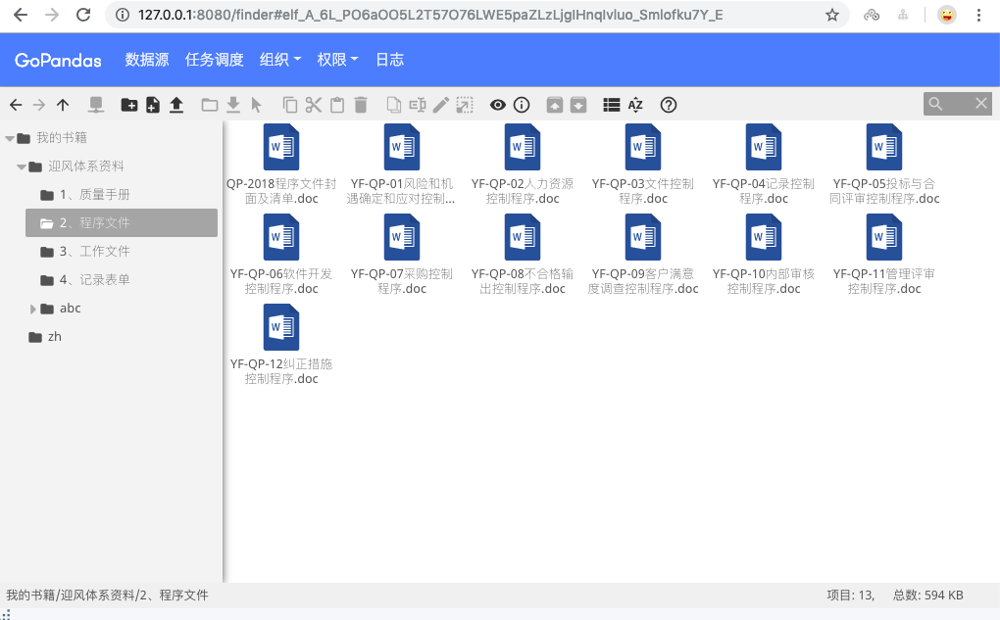

# GoPandas

基于`SpringBoot`，并完全API化、插件化的JAVA Web开发脚手架。



具备以下功能
---------------------

1. 数据源管理
    * 连接池
    * JDBC/ODBC适配的关系型数据库
    * NoSQL、 半结构化文件数据等
    * 连接测试
2. 任务调度
    * 集群
    * 支持CRON表达式、时间间隔、执行一次等任务执行方式
    * 调度异常重试次数
    * 完成或失败提醒或告警通知
3. 安全模块
       * 用户和权限
       * 用户
       * 角色
       * 权限
       * 用户可以把自己的权限赋给他人
       * 用户可以绑定角色或权限; 角色绑定权限
       * 角色可以绑定权限
       * 组织管理
       * 部门管理
       * 员工管理
       * 部门可以绑定角色或权限
       * 员工可以绑定角色或权限
       * 在本系统中，公司(组织)作为一种特殊的部门存在，公司(组织)和部门的区分通过deptType字段来确定
5. 资源管理(elFinder)
6. 日志
    * 记录用户对系统的相关操作
    * 记录应用内的所有错误异常信息
